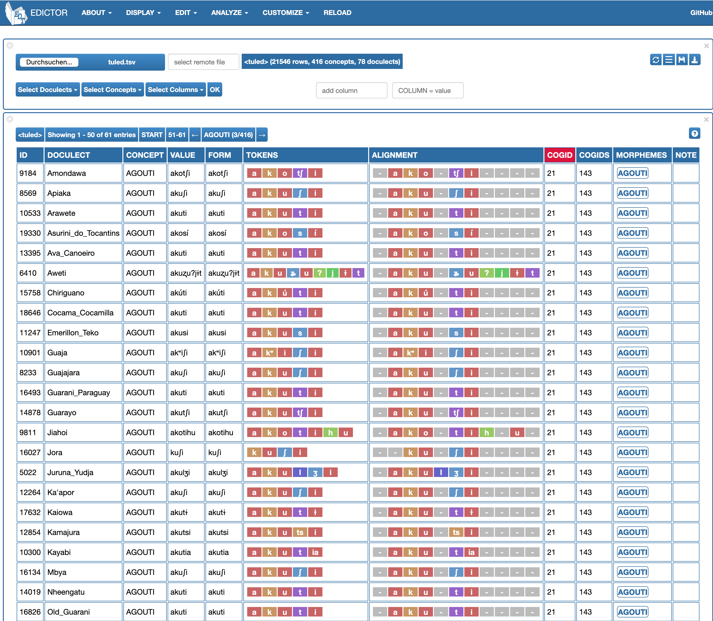

# [Linguistweets](https://www.linguistweets.org) Conference ([ABRALIN](https://www.abralin.org))

This page contains the [Twitter presentation]() and additional comments to it with references. The content was presented (tweeted) by Fabrício Ferraz Gerardi, Tiago Tresoldi and Stanislav Reichert on the 05 of December 2020.

## 1 (Introduction)

  
Tupí-Guaraní (TG) is the largest linguistic family of South-America. Little is known about its spread (genes and languages). Historical linguistics has tools to investigate such issue. Even more aided by digital data, computers, and methods from evolutionary biology.

[Tupí-Guaraní Languages](https://glottolog.org/resource/languoid/id/tupi1276) |  [Phylogenetic Tree](https://www.pnas.org/content/116/45/22657)
:-------------------------:|:-------------------------:
 | 

## 2 (Data)

Using phylogenetic tools (BEAST2, beastling), we build linguistic trees from open-access reusable data in CLDF, lifted with EDICTOR from TuLeD (285 concepts, 40 TG langs, 16211 words). We first detected 2832 cognate sets with LexStat, then reviewed 40% manually (ongoing work).

[TuLeD](https://tuled.org) |  [CLDF](https://cldf.clld.org) | [EDICTOR](https://digling.org/edictor/) |
:-------------------------:|:-------------------------:|:-------------------------:|
 |  |  | 

## 3 (Goal)

Linguistic trees display classifications comparable with results from other fields (Archaeology, Ethnography, History). We first test a model on lexical data only, then we interpret results considering extra-linguistic data, evaluating hypotheses, and accordingly improve data and model.

[Archaeology](https://amazonexpand.wixsite.com/expand) | [Archaeology](https://raw.githubusercontent.com/jgregoriods/rxpand/master/img/tutish.png) | Ethnographic Information |Amount of cognates
:-------------------------:|:-------------------------:|:---------------------:|:---------------------:|
 |  |  |

By **interpreting results considering extra-linguistic data** we mean looking at the trees and interpreting it also considering, e.g., archeological or ethnographical data. The case of Ka'apor is illustrative. Ka'apor seems to have had  a relatively long contact with either Tupinambá or Língua Geral (cf. Ribeiro 1996; Correa da Silva 2011), nonetheless, based on phonological criteria, Ka'apor is grouped with [Wayampi, Emerillon, Anambé of Ehrenreich, and Guajá](https://glottolog.org/resource/languoid/id/tupi1281), languages by Rodriges and Cabral (2011) that are today far apart from each other. In spite of the position of Ka'apor in the tree, we have linguistic data (Rodrigues and Cabral 2011), and the mithology of the Ka'apor themselves giving clues that they were once located more to the west (cf. Huxley 1963; Ribeiro 1996; Balée 1994). 

## 4 (Explaining a model)

Evolutionary methods: we experiment from simple (NJ) to highly complex ones for millions of trees (Bayesian MCMC, covarion model, relaxed clock). The challenge is to deliver the best single tree to summarize the results.

NJ | NeighbourNet | Density Tree | 
:-------------------------:|:-------------------------:|:--------------------:|
(pic)  | (pic) |  |

The Density Tree plots thousands of the best scoring trees on top of each other, highlighting conflicting signals that can be due to a number of reasons, from limited data to a high ratio of borrowings. It also allows us to visually assess how likely some splits and their dates are. In our preliminary density tree, above, where the "root canal" is highlighted in blue, we can see that the groups for Guarani and Tupinambá seem clearly distinct, with some lower but clear probably of the split for the latter group being older than the most likely hypothesis. Some languages also show some conflicting signal: in this analysis, for example, Old Guarani is closer to the Siriono group, but there is a strong signal (visible by the green shade) for a closer membership with the Mbya group. The positions of Zo'e and Kamajurá, as expected, also show a lower degree of confidence.

## 5 (Preliminary RESULTS)

Mawetí-Guaraní hypothesis recognized. Fast expansion of the Guaraní slows ca. year 1580. 4 major groups identified. Blue group supports ethnogr/hist/ling evidence: dialect continuum, common area of origin, close contact. 

[Mawetí-Guaraní Hypothesis](https://glottolog.org/resource/languoid/id/mawe1252) | Phylogenetic Tree | (label) |
:-------------------------:|:-------------------------:|:--------------------:
(pic)  |  | (pic)

The phylogenetic tree above is a consensus tree, computed with a 20% burn-in, which is the best preliminary results so far, accepting some of the monophyletic restrictions given in the literature and confirmed in our previous analyses. Sateré-Mawé forms the first out-group, followed by Awetí, with full confidence (the posterior support at 1.00 for both). The groups highlighted by the root canal in the density tree are confirmed and better organized, with some lower support on the initial moments of expansion. These lower support might be improved with more data and longer analyses, but might also support hypotheses on a rapid expansion in different groups. As for dates, this consensus tree suggests that the expansion of the group, after the ancestor of Awetí had already split, started around 1,100 years ago, with a rapid speciation until circa 500 years ago. The less resolved relationship is between the various Guarani languages, which might indicate a continous contact.

## 6 (To do)

Collect more hist. information, improve cognacy. Cogancy alone is not all include other ling. data. Constrain and calibrate model(s) (dates, geography, ratios, monophyletic groups). 

## Selected Bibliography

Balée, W. L. (1994). Footprints of the forest: Ka'apor ethnobotany-the historical ecology of plant utilization by an Amazonian people. Columbia University Press.

Bouckaert R., Heled J., Kühnert D., Vaughan T., Wu C. H.,Xie D., et al. (2014). BEAST2: A Software Platform for Bayesian Evolutionary Analysis. PLoS Comput Biol. 10(4).

Greenhill, S. J., Heggarty, P., & Gray, R. D. (2020). Bayesian Phylolinguistic. In R. D. Janda, B. D. Joseph, & B. S. Vance (Eds.), The Handbook of Historical Linguistics (pp. 226-253). Hoboken, New Jersey: Wiley-Blackwell. 

Huxley, F. (1963). Selvagens amáveis:(um antropologista entre os índios Urubus do Brasil). Brasiliana.

[List, J. M. (2017, April). A web-based interactive tool for creating, inspecting, editing, and publishing etymological datasets. In Proceedings of the Software Demonstrations of the 15th Conference of the European Chapter of the Association for Computational Linguistics (pp. 9-12).](https://digling.org/edictor/)

Maurits, L., Forkel, R., Kaiping, G. A., Atkinson, Q. D. (2017) BEASTling: A software tool for linguistic phylogenetics using BEAST 2. PLOS ONE.

Meira, S., & Drude, S. (2015). A summary reconstruction of Proto-Maweti-Guarani segmental phonology. Boletim do Museu Paraense Emílio Goeldi. Ciências Humanas, 10(2), 275-296.

Nunn, C. L. (2011). The comparative approach in evolutionary anthropology and biology. University of Chicago Press.

Rodrigues, A. D., & Cabral, A. S. A. C. (2002). Revendo a classificação interna da família Tupí-Guaraní. Línguas Indígenas Brasileiras. Fonologia, Gramática e História, Atas do I Encontro Internacional do GTLI da ANPOLL, 1.

Rodrigues, A., & Cabral, A. S. (2012). Tupían. In L. Campbell & V. Grondona. The Indigenous Languages of South America: a comprehensive guide.

Rodrigues, A. D., & Dietrich, W. (1997). On the linguistic relationship between Mawé and Tupí-Guaraní. Diachronica, 14(2), 265-304.

Silva, Beatriz Carretta C. D. (2011). Mawé/Awetí/Tupí-Guaraní: relações lingüísticas e implicações históricas. University of Brasília. Unpublished PhD thesis.

