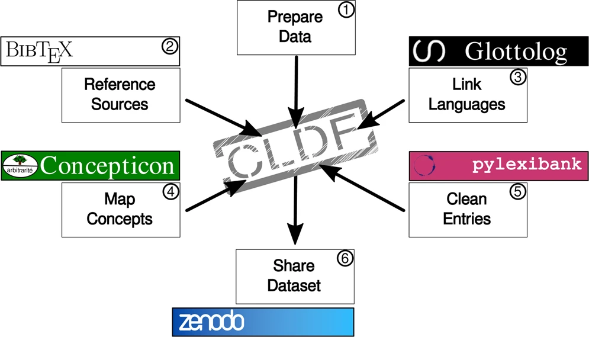
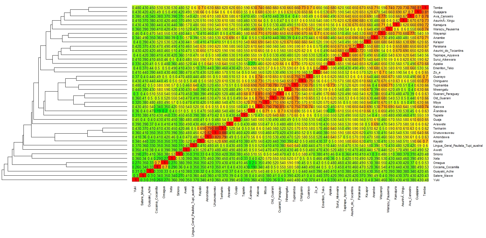

# [Linguistweets](https://www.linguistweets.org) Conference ([ABRALIN](https://www.abralin.org))

This page contains the [Twitter presentation]() and additional comments to it with references. The content was presented (tweeted) by Fabrício Ferraz Gerardi, Tiago Tresoldi and Stanislav Reichert on the 05 of December 2020.

## 1 (Introduction)

Tupí-Guaraní (TG) is the largest linguistic family of South America. We want to know more about its spread (peoples and languages). Historical linguistics has tools to investigate this issue aided by digital data, computers, and methods from evolutionary biology.

[Tupí-Guaraní Languages](https://glottolog.org/resource/languoid/id/tupi1276) |  [Phylogenetic Tree](https://www.pnas.org/content/116/45/22657)
:-------------------------:|:-------------------------:
 | 

## 2 (Data)

Using phylogenetic tools (BEAST2, beastling), we build linguistic trees from open-access reusable data in CLDF, lifted with EDICTOR from TuLeD (285 concepts, 16211 words, 41 TG langs of 78 in TuLeD). 2832 cognate sets detected with LexStat, 40% manually reviewed (ongoing work).

[TuLeD](https://tuled.org) |  [CLDF](https://cldf.clld.org) | [EDICTOR](https://digling.org/edictor/)      |
:-------------------------:|:-------------------------:|:-------------------------:|
 |  |  | 

## 3 (Goal)

Linguistic trees display classifications comparable with results from other fields (Archaeology, Ethnography, History). We test a model on lexical data only, then we interpret results considering extralinguistic data, evaluating hypotheses, and improve data and model accordingly.

[Archaeology](https://amazonexpand.wixsite.com/expand) | [Archaeology](https://raw.githubusercontent.com/jgregoriods/rxpand/master/img/tutish.png) | Ethnographic Information |Amount of cognates
:-------------------------:|:-------------------------:|:---------------------:|:---------------------:|
 |  |  |

## 4 (Explaining a model)

Evolutionary methods: we start from simple (NJ) to highly complex ones for millions of trees (Bayesian MCMC, covarion model, relaxed clock, independent rates of variation). Basic calibrations from literature. Challenge: deliver the best single tree that summarizes the results.

NJ | NeighbourNet | Density Tree | (Gerhard's method) |
:-------------------------:|:-------------------------:|:--------------------:|:-----------------|
(pic)  | (pic) |  | (pic)

## 5 (Preliminary RESULTS)

Mawe-Awetí-TG hypothesis recognized. Fast expansion of Guaraní (light blue) until 400 years ago. 4 major groups identified. Blue group supports ethnogr/hist/ling evidence: dialect continuum, common area of origin, close contact. Fits archaeological dates (Almeida & Neves 2015). 

[Mawetí-Guaraní Hypothesis](https://glottolog.org/resource/languoid/id/mawe1252) | Phylogenetic Tree | (label) |
:-------------------------:|:-------------------------:|:--------------------:
(pic)  |  | (pic)

## 6 (To do and REFS)

Collect more historical info, improve cognacy. Cognacy alone is not all; include other linguistic data. Constrain and calibrate model(s) (dates, geography, ratios, monophyletic groups). More info, references, and comments: https://tular.org/tgtweet. Thank you! 
